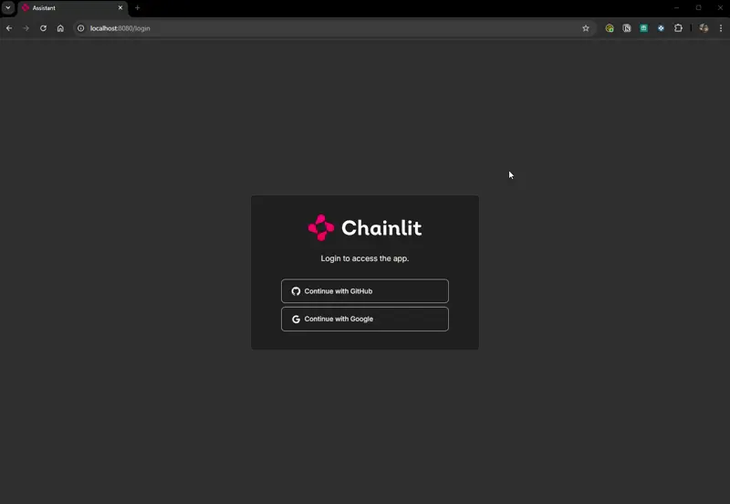

# SEC Copilot

SEC Copilot is an LLM-powered chatbot that retrieves financial reports from the SEC database, allowing users to ask questions, summarize details, and gain insights from financial data.

## Features

- Fetch financial reports from the SEC database
- Ask questions about specific companies or financial metrics
- Summarize key details from financial reports
- Powered by advanced language models for intelligent interactions

## Demo



## Setup

### Prerequisites

- Python 3.10 or higher


### Supported Operating Systems

Currently, the application and development environment is only tested on Linux, but is being implemented to work on MacOS and Unix systems as well. I'll clone this repo and test things on my personal Macbook Pro at a later date.

- MacOS
- Linux
- Unix

### Environment Setup

1. Clone the repository:
   ```
   git clone https://github.com/yourusername/secbot.git
   cd secbot
   ```

2. Set up the environment:

   ```
   make env
   ```

   This command will:
   - Install uv if not already present
   - Create a virtual environment
   - Install project dependencies
   - Set up pre-commit hooks

3. Create a `.env` file in the project root and add your OpenAI API key:

   ```
   OPEN_AI_TOKEN=your_api_key_here
   ```

   Or export this environment variable in your applicable `~/.zshrc`, `~/.bashrc`, etc.

4. Create a JWT secret for Chainlit authentication:

   ```
   uv run chainlit create-secret
   ```

   Add the generated secret to your `.env` file:

   ```
   CHAINLIT_AUTH_SECRET=your_generated_secret_here
   ```

5. Add OAuth keys to your `.env` file:

   ```
   OAUTH_GITHUB_CLIENT_ID=your_github_client_id
   OAUTH_GITHUB_CLIENT_SECRET=your_github_client_secret
   OAUTH_GOOGLE_CLIENT_ID=your_google_client_id
   OAUTH_GOOGLE_CLIENT_SECRET=your_google_client_secret
   ```

   For more details on setting up authentication, refer to the [Chainlit Authentication Documentation](https://docs.chainlit.io/authentication/overview).

## Running the Application

To run the application:

```
make run
```

## Running Tests

To run the test suite:

```
make test
```

## Development Workflow

This project uses several tools to maintain code quality and consistency:

1. **uv**: A fast Python package installer and resolver. It's used instead of pip for faster dependency management.

2. **Ruff**: A fast Python linter and formatter. It's configured to run automatically on pre-commit.

3. **Pre-commit hooks**: Automatically run before each commit to ensure code quality. They include:
   - Ruff for linting and formatting
   - Pytest for running tests before pushing changes

To manually run pre-commit hooks:

```
pre-commit run --all-files
```

## Contributing

Contributions are welcome! Please feel free to submit a Pull Request.

1. Fork the repository
2. Create your feature branch (`git checkout -b feature/AmazingFeature`)
3. Commit your changes (`git commit -m 'Add some AmazingFeature'`)
4. Push to the branch (`git push origin feature/AmazingFeature`)
5. Open a Pull Request

## License

This project is licensed under the MIT License - see the [LICENSE](LICENSE) file for details.

## Contributors

- [Gerald Sornsen](https://github.com/gsornsen)

## Acknowledgments

- OpenAI for providing the language model capabilities
- SEC for making financial data accessible
